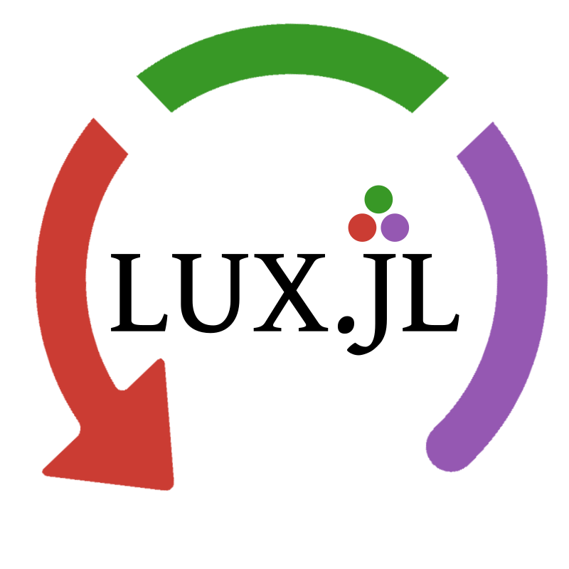

<p align="center">
    
</p>

<div align="center">


| **Documentation** | **Build Status** | **Julia** | **Testing** |
|:-----------------:|:----------------:|:---------:|:-----------:|
| [![docsstbl][docs-stbl]][docsstbl-url] [![docsdev][docs-dev]][docsdev-url] | [![CI][ci-img]][ci-url] | [![Julia][julia-img]][julia-url] [![Code Style: Blue][style-img]][style-url] | [![Aqua QA][aqua-img]][aqua-url] [![JET][jet-img]][jet-url] [![codecov][cc-img]][cc-url] |


[docs-stbl]: https://img.shields.io/badge/docs-stable-blue.svg
[docsstbl-url]: https://MartinuzziFrancesco.github.io/LuxRecurrentLayers.jl/stable/

[docs-dev]: https://img.shields.io/badge/docs-dev-blue.svg
[docsdev-url]: https://MartinuzziFrancesco.github.io/LuxRecurrentLayers.jl/dev/

[ci-img]: https://github.com/MartinuzziFrancesco/LuxRecurrentLayers.jl/actions/workflows/CI.yml/badge.svg?branch=main
[ci-url]: https://github.com/MartinuzziFrancesco/LuxRecurrentLayers.jl/actions/workflows/CI.yml?query=branch%3Amain

[cc-img]: https://codecov.io/gh/MartinuzziFrancesco/LuxRecurrentLayers.jl/branch/main/graph/badge.svg
[cc-url]: https://codecov.io/gh/MartinuzziFrancesco/LuxRecurrentLayers.jl

[julia-img]: https://img.shields.io/badge/julia-v1.10+-blue.svg
[julia-url]: https://julialang.org/

[style-img]: https://img.shields.io/static/v1?label=code%20style&message=SciML&color=9558b2&labelColor=389826
[style-url]: https://github.com/SciML/SciMLStyle

[aqua-img]: https://raw.githubusercontent.com/JuliaTesting/Aqua.jl/master/badge.svg
[aqua-url]: https://github.com/JuliaTesting/Aqua.jl

[jet-img]: https://img.shields.io/badge/%E2%9C%88%EF%B8%8F%20tested%20with%20-%20JET.jl%20-%20red
[jet-url]: https://github.com/aviatesk/JET.jl

</div>

<div align="center">
    <h2>LuxRecurrentLayers.jl</h2>
</div>

> [!WARNING]  
> Currently heavy work in progress, please check out
> [RecurrentLayers.jl](https://github.com/MartinuzziFrancesco/RecurrentLayers.jl)
> for a more polished recurrent layers library.

LuxRecurrentLayers.jl extends [Lux.jl](https://github.com/LuxDL/Lux.jl)
recurrent layers offering by providing implementations of additional
recurrent layers not available in base deep learning libraries.

## Installation

LuxRecurrentLayers.jl is not on the general registry yet! To install it please
use:
```julia_repl
julia> ]
Pkg> add https://github.com/MartinuzziFrancesco/LuxRecurrentLayers.jl
```

## Quick Example

```julia
using Lux, LuxRecurrentLayers, Random
# Seeding
rng = Random.default_rng()
Random.seed!(rng, 0)

# Define the recurrent model (a cell in this case)
rnn = AntisymmetricRNNCell(3=>5)
# Get parameters and states
ps, st = Lux.setup(rng, rnn)

# Random input
inp = rand(Float32, 3)

# Forward pass with random input
output, st = Lux.apply(rnn, inp, ps, st)
```


## See also

[RecurrentLayers.jl](https://github.com/MartinuzziFrancesco/RecurrentLayers.jl):
Equivalent library, providing recurrent layers for Flux.jl.

[ReservoirComputing.jl](https://github.com/SciML/ReservoirComputing.jl):
Reservoir computing utilities for scientific machine learning.
Essentially gradient free trained neural networks.